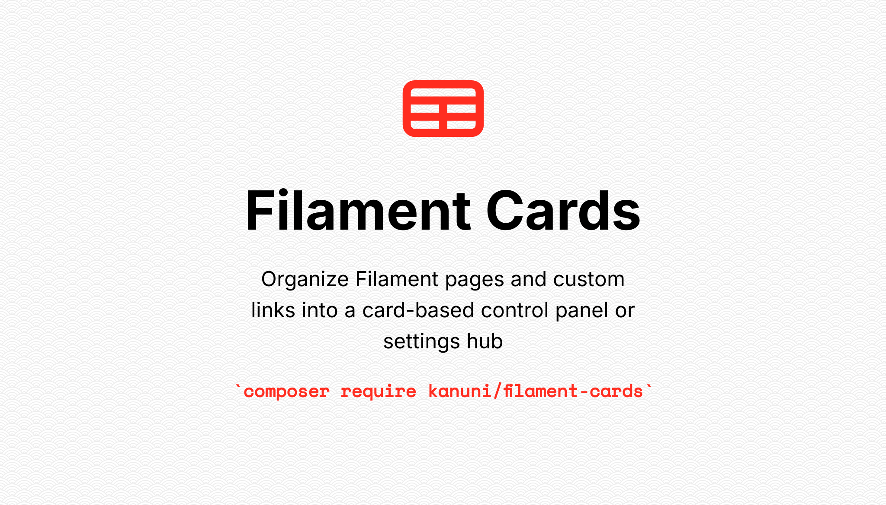
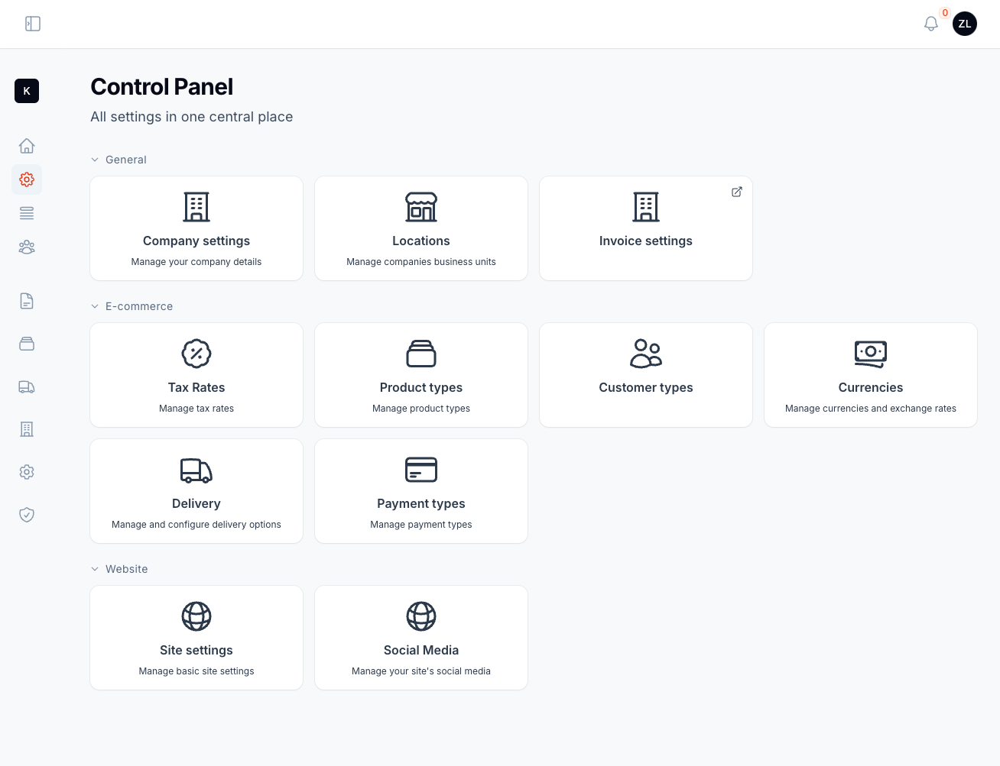
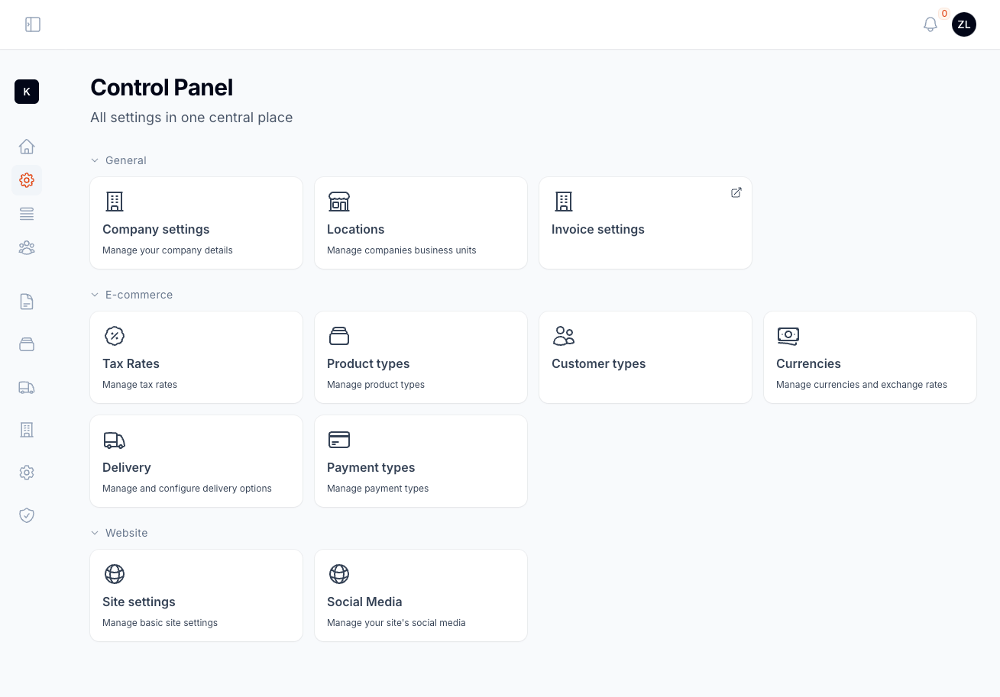
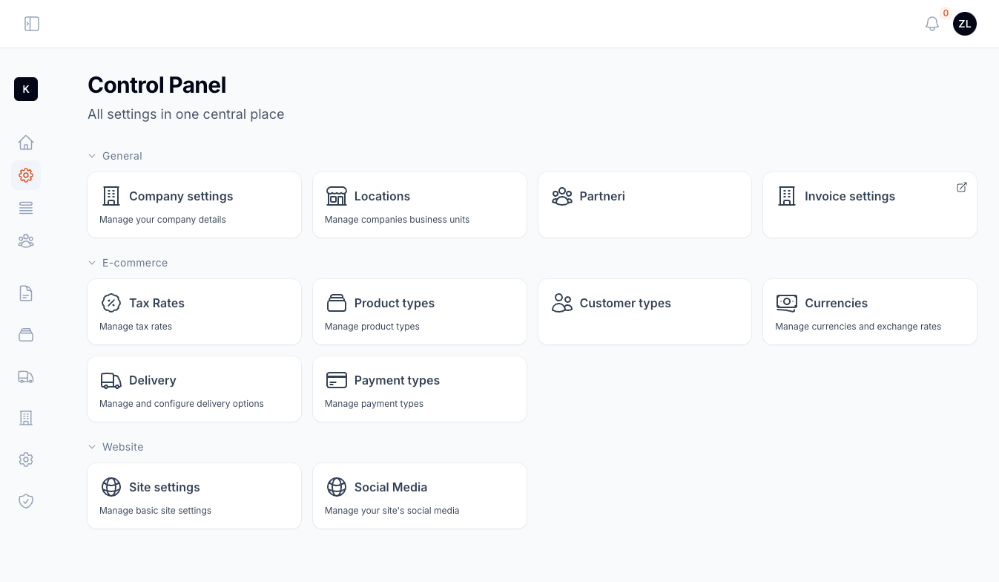

# Filament Cards Plugin

[](https://packagist.org/packages/kanuni/filament-cards)
[](https://opensource.org/licenses/ISC)
[](https://packagist.org/packages/kanuni/filament-cards)

- [Intro](#intro)
- [Screenshot](#screenshot)
- [Installation](#installation)
- [Creating a Cards Page](#creating-a-cards-page)
- [Adding Custom Link as Card Item](#adding-custom-link-as-card-item)
- [Grouping Panel Items](#grouping-panel-items)
    - [Collapse Groups](#collapse-groups)
    - [Prevent Groups from Collapsing](#prevent-groups-from-collapsing)
- [Defining a Custom URL and/or Open Link in New Tab](#defining-a-custom-url-andor-open-link-in-new-tab)
- [Customizing the Display of Card Items](#customizing-the-display-of-card-items)
    - [Changing the Icon Size](#changing-the-icon-size)
    - [Inlining the Icon with the Card Title](#inlining-the-icon-with-the-card-title)
- [Configuring Breadcrumbs for Pages Opened from the Cards Page](#configuring-breadcrumbs-for-pages-opened-from-the-cards-page)

## Intro

The Filament Cards plugin enables you to create a page containing cards. Card items can be other Filament pages or custom item with a link and can be organized into logical groups for easier navigation, if you have a lots of cards. Each card can have title, an icon and description. When Filament page is added as an item, the cards page automatically applied the page's title, icon and URL, although you can customize these properties as needed.

The best use case for this plugin would be application control panel or settings hub, where you can organize all of the application settings on one page.

## Screenshot



Default view of the Cards Page with items organized into groups and displayed as individual cards

## Installation

Install the plugin using Composer:

```bash
composer require kanuni/filament-cards
```

In an effort to align with Filament's theming methodology you will need to use a custom theme to use this plugin.

> **Note**
> If you have not set up a custom theme and are using a Panel follow the instructions in the [Filament Docs](https://filamentphp.com/docs/3.x/panels/themes#creating-a-custom-theme) first. The following applies to both the Panels Package and the standalone Forms package.

Add the plugin's views to your `tailwind.config.js` file.

```js
content: [
    './vendor/kanuni/filament-cards/resources/**/*.blade.php',
]
```

## Creating a cards page

As an example, we will create a custom Filament page that will serve as an application control panel. Start by creating a Filament page at `App\Filament\Pages\ControlPanel.php`. Instead of extending the default Filament page class, this page should extend the `Kanuni\FilamentCards\Filament\Pages\CardsPage` class.

Additionally, we need to define a private static method, `getCards()`, which returns an array of `CardItem` objects.

```php
namespace App\Filament\Pages;

use Kanuni\FilamentCards\Filament\Pages\CardsPage;
use Kanuni\FilamentCards\CardItem;
use App\Filament\Pages\CompanySettings;

class ControlPanel extends CardsPage
{
    protected static ?string $navigationIcon = 'heroicon-o-cog-8-tooth';

    private static function getCards(): array
    {
        return [
            CardItem::make(CompanySettings::class)
        ];
    }
}
```

In above example we added `CompanySettings` page as card item on our control panel page. The card item will inherit title and icon from that page. If you want to override that convention or add optional description you can use methods `title()`, `icon()` and `description()` on `CardItem` object.

Note that if the page provided to the card item belongs to a Filament resource, the title and icon will automatically be derived from the resource class.

## Adding Custom Link as Card Item

You can add custom link as a card item by passing URL to CardItem's `make()` method. See following example:

```php
use Kanuni\FilamentCards\CardItem;

private static function getCards(): array
{
    return [
        CardItem::make('/path/to/docs')
            ->title('Documentation')
            ->icon('heroicon-o-document-text')
            ->description('Read the docs')
    ];
}
```

## Grouping Panel Items

Organize card items into collapsible groups by using the `group()` method on a `CardItem` object:

```php
use Kanuni\FilamentCards\CardItem;

private static function getCards(): array
{
    return [
        CardItem::make(CompanySettings::class)->group('General')
    ];
}
```

### Collapse Groups

By default, all groups on the card's page are expanded when you open the page. However, you can specify which groups should be collapsed initially. To do this, use the `$collapsedGroups` property on the card's page instance and pass an array of group names to be collapsed.

```php
use Kanuni\FilamentCards\Filament\Page\CardsPage;

class ControlPanel extends CardsPage
{
    protected static array $collapsedGroups = ['General', 'Advanced'];

    private static function getCards(): array
    {
        return [...];
    }
}
```

In this example, the "General" and "Advanced" groups will be collapsed by default, allowing users to expand them only when needed. This feature helps keep the page organized, especially when there are multiple groups containing lots of items.

If you need to conditionaly collapse some of the groups you can override `getCollapsedGroups()` on your page and return list of groups that should be collapsed, for example:

```php
use Kanuni\FilamentCards\Filament\Page\CardsPage;

class ControlPanel extends CardsPage
{
    public function getCollapsedGroups(): array
    {
        if (auth()->user()->role !== 'admin') {
            // For non-admin users collapse 'Advanced' group
            return ['Advanced'];
        }

        return [];
    }
}
```

### Prevent Groups from Collapsing

You can control the collapse functionality for groups by overriding the protected static property `$disableGroupsCollapse`. This property can either be:

- A `bool`, to enable or disable collapsing for all groups
- An `array` of specific group names, to prevent only those groups from being collapsed

To completely disable the ability to collapse groups, set `$disableGroupsCollapse` to true:

```php
use Kanuni\FilamentCards\Filament\Page\CardsPage;

class ControlPanel extends CardsPage
{
    // Disable collapsing for all groups
    protected static bool|array $disableGroupsCollapse = true;
}
```

To disable collapsing only for certain groups, define an `array` of group names:

```php
use Kanuni\FilamentCards\Filament\Page\CardsPage;

class ControlPanel extends CardsPage
{
    // Disable collapsing for the 'General' group
    protected static bool|array $disableGroupsCollapse = ['General'];
}
```

## Defining a Custom URL and/or Open Link in New Tab

By default, when your card item is a Filament page the card item uses that page's URL. However, you can specify a custom URL with the `url()` method on the `CardItem` object:

```php
use Filament\FilamentCards\CardItem;

private static function getCards(): array
{
    return [
        CardItem::make(CompanySettings::class)
            // Override page URL
            ->url('https://www.google.com')
            // Will open link in new tab
            ->openInNewTab()
    ];
}
```

You can also use absolute URL's like in the above example. Optionally you can change to open the link in new browser tab using `openInNewTab()` method.

## Customizing the Display of Card Items

By default, the content of each card item (title, icon, and description) is stacked and centered. Customize this alignment with the `$itemsAlignment` property on the card's page. The property must be an enum value from `Kanuni\FilamentCards\Enums\Alignment`. Possible values are `Alignment::Start`, `Alignment::Center` and `Alignment::End`.

```php
use Kanuni\FilamentCards\Filament\Page\CardsPage;
use Kanuni\FilamentCards\Enums\Alignment;

class ControlPanel extends CardsPage
{
    // Change alignment of card's title, icon and description
    protected static Alignment $itemsAlignment = Alignment::Start;
}
```



### Changing the Icon Size

You can customize the icon size by overriding `$iconSize` property on the card's page. This property must be  value from the `Filament\Support\Enums\IconSize` enum. There are three sizes `IconSize::Small`, `IconSize::Medium` and `IconSize::Large`. Default size is medium.

```php
use Kanuni\FilamentCards\Filament\Page\CardsPage;
use Filament\Support\Enums\IconSize;

class ControlPanel extends CardsPage
{
    // Change the size of card's icons
    protected static IconSize $iconSize = IconSize::Small;
}
```

### Inlining the Icon with the Card Title

To display an item's icon inline with its title, override the `$iconInlined` property on the card's page.

```php
use Kanuni\FilamentCards\Filament\Page\CardsPage;
use Filament\Support\Enums\IconSize;

class ControlPanel extends CardsPage
{
    // Inline the card's icon with title
    protected static bool $iconInlined = true;
}
```

In the screenshot below, the icons are aligned with the title and set to a small size.



## Configuring Breadcrumbs for Pages Opened from the Cards Page

By default, pages opened from the cards page will display the standard breadcrumbs. If you want to customize the breadcrumbs for pages accessed through the cards page, you can add the `Kanuni\FilamentCards\Concerns\HasOriginBreadcrumb` trait in your page class.

```php
namespace App\Filament\Pages;

use Filament\Pages\Page;
use Kanuni\FilamentCards\Concerns\HasOriginBreadcrumb;

class CompanySettings extends Page
{
    use HasOriginBreadcrumb;
}
```

When this trait is applied, the breadcrumbs will be set according to the card item, but only if the page is accessed from the card's page. This allows you to customize the navigation for card-related pages while keeping default behavior for other pages.
